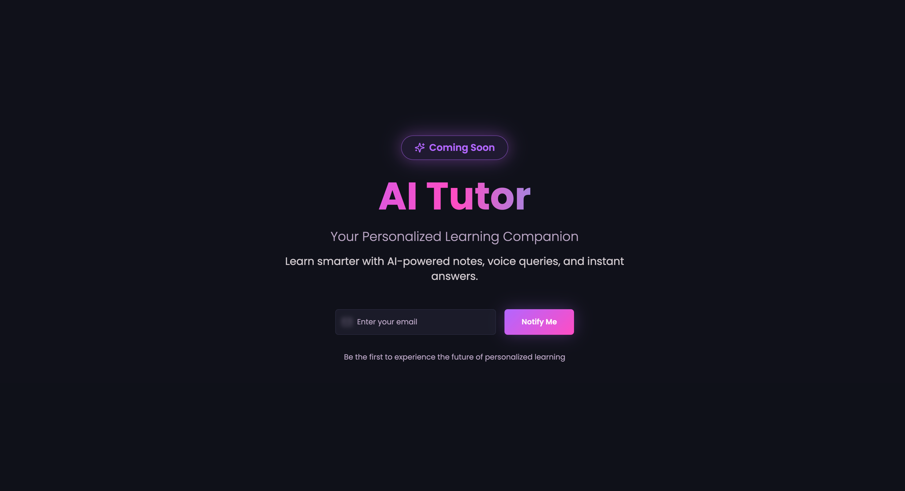
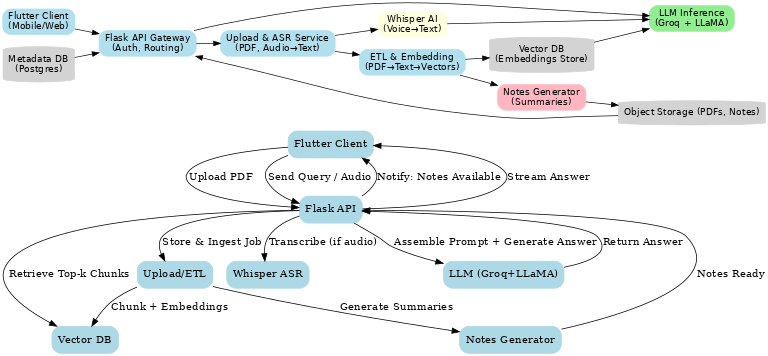

# 🤖 AI-Powered Tutor with RAG and Multimodal Support  

An intelligent tutor platform that helps students learn directly from their own study materials. Upload PDFs, generate structured notes, ask questions through chat or voice, and receive accurate, context-aware explanations — powered by Retrieval-Augmented Generation (RAG), Whisper AI, and LLaMA models integrated via GroqAI.  

---

## 📝 Project Overview  

This project enables students to:  
- 📂 Upload study material in **PDF format**.  
- 📝 Automatically **extract key content** and generate personalized study notes.  
- 💬 Interact with an **AI-powered tutor** for Q&A using **RAG**.  
- 🎤 Ask questions using **voice input** with **Whisper AI transcription**.  
- ⚡ Get fast, context-aware responses via **LLaMA models on GroqAI**.  

---

## ⚙️ Tech Stack  

**Frontend**  
- Flutter (cross-platform mobile & web app)  
- Chat interface, PDF upload, voice input  

**Backend**  
- Flask (REST APIs for orchestration & processing)  

**AI Components**  
- 📄 PDF parsing & text extraction → Vector embeddings stored in DB  
- 🔎 RAG pipeline for context-based Q&A  
- 🎤 Whisper AI for speech-to-text query transcription  
- 🤖 GroqAI + LLaMA for low-latency inference  

**Database**  
- Vector Database: Pinecone / Weaviate / FAISS  

---

## 🚀 Key Features  

- 📂 Upload PDFs and auto-generate **structured study notes**.  
- 🔎 **RAG-enabled chatbot** for accurate, context-driven answers.  
- 🎤 **Voice-based queries** with Whisper AI transcription.  
- 📘 Personalized tutor responses tailored to uploaded content.  
- 📱 Cross-platform availability via Flutter (Android, iOS, Web).  

---

## 🔑 My Contributions  

- Designed the complete **RAG pipeline** (vector embeddings → retrieval → LLaMA response).  
- Integrated **Whisper AI** for multilingual voice transcription.  
- Built **Flask APIs** for vector storage, retrieval, and tutoring logic.  
- Developed **Flutter UI** for chat, uploads, and interactive learning.  
- Optimized **GroqAI integration** for **real-time, low-latency responses**.  

---

## 🎯 Impact  

- Empowered students to **learn from their own materials** with AI assistance.  
- Increased **accessibility** through **voice-based learning**.  
- Showcased practical integration of **LLMs, RAG, and multimodal input**.  

---

## 📸 Demo & Media  

👉 

